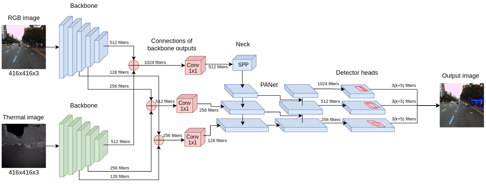
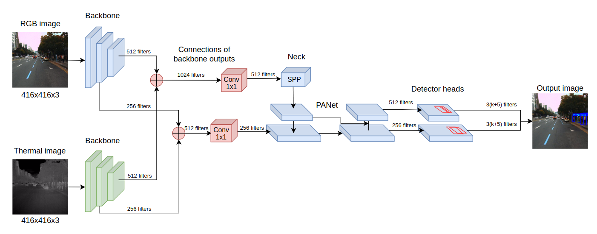

# YOLOv4-Middle detector
An enhanced version of the YOLOv4 detector, which is a middle fusion method and combines RGB and thermal images for pedestrian detection.

This code was used in a paper by K. Roszyk, M. Nowicki and P. Skrzypczynski entitled:
"Adopting the YOLOv4 architecture for low-latency multispectral pedestrian detection in autonomous driving."

Additionally, a Tiny version of the detector has been added to enable real-time performance due to the high number of FPS.

### Benchmark results achieved on NVidia RTX 3080 GPU:

|  YOLOv4 version   | maP_50 values | FPS number |
|:-----------------:|:-------------:|:----------:|
|   YOLO4-Middle    |     0.686     |   35.23    |
| YOLO4-MIddle-Tiny |     0.557     |   410.07   |

#### Scheme of YOLO4-Middle

#### Scheme of YOLO4-Middle-Tiny

### KAIST data
The data that was used to train and validate the model can be downloaded at the following link. They include daytime and nighttime images for the RGB and thermal imaging camera respectively. Interestingly, thanks to a special rack, the annotations fit simultaneously for data from both types of cameras.  
https://soonminhwang.github.io/rgbt-ped-detection/data/

### Main scripts 

- **configs.py** - contains all configurations needed to launch YOLO4-Middle training and evaluation.
- **yolov4_f.py** - contains all DL blocks and backbone modifications.
- **evaluate_mAP** - contains calculations of mAP metric.
- **train.py** - contains training code.
- **convert_to_trt** - contains code allowing to transform the model to TensorRT, what increases number of FPS.

### Example performance of YOLO4-middle detector during night

### Statement
This repository was forked from https://github.com/pythonlessons/TensorFlow-2.x-YOLOv3 and is YOLOv4 modification written in TF 2.3.1.